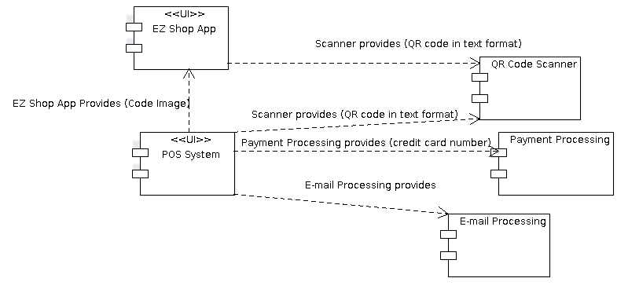
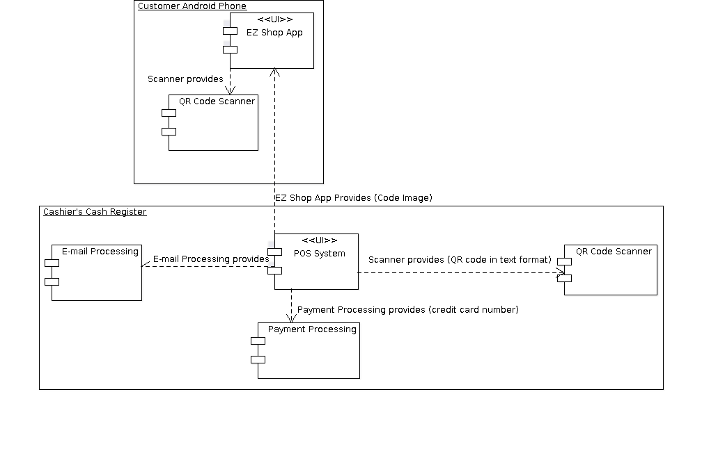
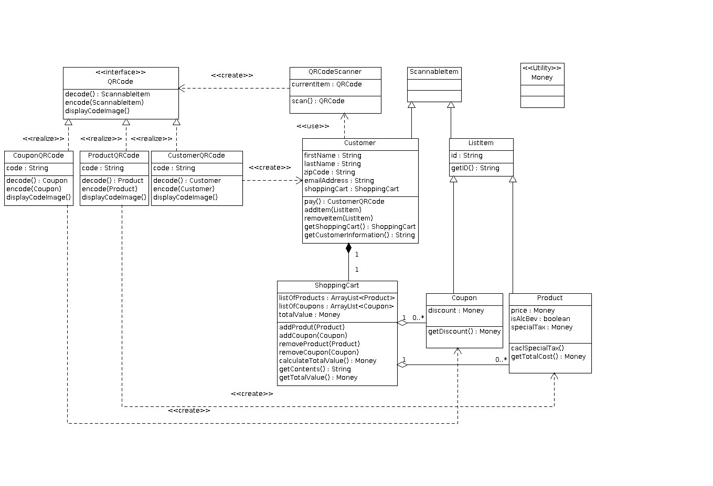
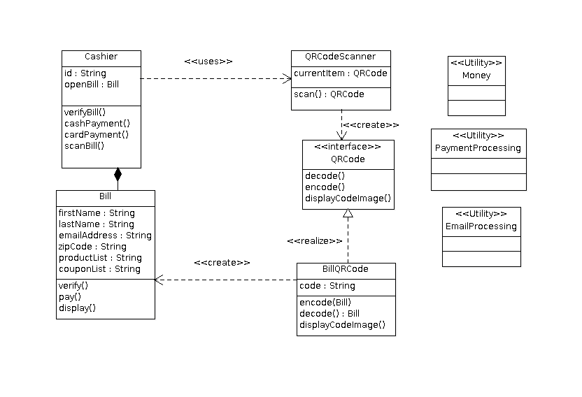
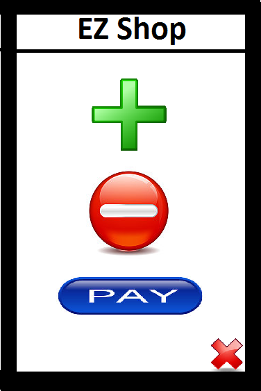
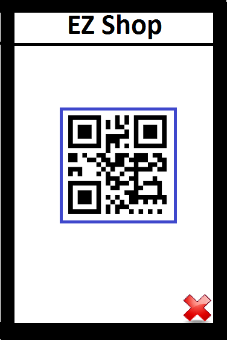

# Design Document

**Author**: \<Kyle Sullivan (ksullivan40@gatech.edu)\>

## 1 Design Considerations

### 1.1 Assumptions

* It will be assumed that all customer data including shopping cart lists of coupons and products can fit in one QR Code.
* It will be assumed the QR Code Scanner can have an expected input code format specified to it by both the EZ Shop App and the POS System. Further, it will be assumed that the Scanner can raise an exception if the formatting isn't correct (wrong type of item).
* It will be assumed the QR Code Scanner automatically captures an image of the QR Code when it identifies one.

#### EZ Shop App Assumptions
* The GUI operations will be handled within the Main() method and are not modeled.
* Coordination between GUI operations and operations within the classes are handled by the Main() method.
* The QRCode generated when the customer card is scanned is in the same format as the QRCode generated when the customer chooses to pay.
  * The only difference is that the QRCode generated by the pay() method has the bill's requirements (shopping cart contents and total value) appended to the customer information in the QR code. 
  * The QR code on the customer card has space holders for that information but there is no data withnin the holders. 
  * The CustomerQRCode decode() method recognizes the lack of shopping cart contents and total value in the card's QR Code and then initializes an empty ShoppingCart within the Customer class during the instantiation of that class.
* If a product QR Code has the AB prefix then the ProductQR code decode method sets the Product isAlcbev flag to true.
  * If the Product isAlcBev flag is set to true then the getTotalCost() method will automatically calculate the special tax for that item.
* The QRCodeScanner automatically instantiates the correct implementation of QRCode based on the format of the given QR Code.
* The Shopping Cart applies coupons to products **each time** getTotalValue() is called.
  * The getContents() operation returns a string of products and coupons that can be paresed by the CustomerQRCode encode method to meet the requirements of the bill output.
* It is assumed there is a utility Money that handles formatting of and all operations concerning money (products and coupons).
* A customer can add coupons at anytime, even if there are no products in the cart corresponding to those coupons. The coupons will simply be ignored if they don't apply at bill generation.
* Customers will only add or remove one product at a time. There is no way for the customer to enter multiple quantities of one item other than scanning them all individually.

#### POS System Assumptions

* The logic to verify signatures and enter cash amounts is contained within the cardPayment() and cashPayment() methods, respectively.
* A cashier can only have one open bill at a time.
* It will be assumed that the POS System has access to e-mail processing and payment processing utilities.
* For the purpose of logging in to the POS System, it will be assumed the system has access to a simple database that lists valid cashier IDs.

### 1.2 Constraints

* The system is constrained by the amount of data that can fit into a QR Code.
* The system is constrained by memory and processing power on the customer's android device.
* Manufacturers produce the products and coupons, and it is possible they could change the formatting of their QR Codes and impact the entire system.
* The system is constrained by the cashier's ability to accurately assess the accuracy of the customer's bill in relation to actual shopping cart contents.
* The system is constrained by the cahsier's ability to accurately assess the accuracy of the customer's signature when paying with credit card.
* the system is constrained by the customer's ability to accruately scan all items in their shopping cart.

### 1.3 System Environment

* The EZ Shop App will be developed on the Android 5.0 platform.
* The POS System will be devloped in core Java 1.7 on a linux-based platform.
* The POS System has a driver for an external device connected via USB that scans QR Codes.
* The POS System has a monitor and associated driver attached to it.

## 2 Architectural Design

### 2.1 Component Diagram

The two major components in this system are the EZ Shop App and the POS System. There are three provided components: the QR Code Scanner, Payment Processing, and E-mail Processing. The EZ Shop App provides the interface between itself and the POS System in the form of a QR Code rendered on its screen that can be scanned by the POS System. The POS System uses the EX Shop App to read and then decode a QR code that has all the information necessary to display a bill on the POS System screen. Both the EZ Shop App and the POS System use the QR Code Scanner component. The QR Code Scanner provides the interface with both by decoding the QR Codes it scans into text format that can be transmitted to those components. 

### 2.2 Deployment Diagram

The two major devices in the system are the customer's Android phone and the cashier's cash register. The QR Code Scanner Component is present on both pieces of hardware.

## 3 Low-Level Design

### 3.1 Class Diagram
 
#### 3.11 EZ Shop App

#### 3.12 POS System

## 4 User Interface Design

###4.1 Shopping Mode Screen

* This is the primary screen for the EZShop App. It has the add coupon/product button, the subtract product button, and the pay button. In addition it has the small "X" that allows the customer to exit the app.

###4.2 QR Code Scanner Screen

* This is the QR Code Scanner screen that is used anytime a QR code is scanned. This is also launched during the app launch. The only differences are the confirmation or error messages that are produced based on the expected format of the incoming code as defined by the application prior to launching the scanner.

