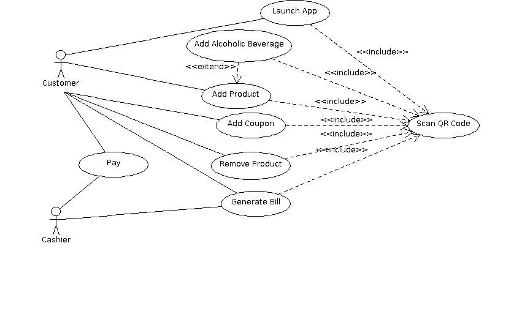

# Use Case Model

*This is the template for your use case model. The parts in italics are concise explanations of what should go in the corresponding sections and should not appear in the final document.*

**Author**: Kyle Sullivan (ksullivan40@gatech.edu)

## 1 Use Case Diagram

*This section should contain a use case diagram with all the actors and use cases for the system, suitably connected.*

## 2 Use Case Descriptions

*For each use case in the use case diagram, this section should contain a description, with the following elements:*

- *Requirements: High-level description of what the use case must allow the user to do.*
- *Pre-conditions: Conditions that must be true before the use case is run.*
- *Post-conditions Conditions that must be true once the use case is run.*
- *Scenarios: Sequence of events that characterize the use case. This part may include multiple scenarios, for normal, alternate, and exceptional event sequences. These scenarios may be expressed as a list of steps in natural language or as sequence diagrams.*

###1. Launch App
   * **Requirements:** The Launch App use case must allow the customer to launch launch the EZ Shop Application, scan their card, initialize all customer data, and enter into grocery shopping mode.

   * **Pre-conditions:** The cusomter's phone is on and the EZ Shop Application is not running.

   * **Post-Conditions:** The cusomter's information has been intialized, an empty shopping cart has been created in the application, and and the application is in grocery shopping mode.

   * **Scenarios:** 

      **1. Normal Scenario**

      1.1 The customer touches the EZ Shop App icon on their phone.

      1.2 The application launches.

      1.3 The application's QR Code Scanner opens from within the app.

      1.4 The customer holds their customer card's QR code in front of the camera on their phone.

      1.5 The application identifies the QR Code and reads its data.

      1.6 The application initializes the customer's first name, last name, zip code, and e-mail address within the application using the QR code data.

      1.7 The application creates an empty shopping cart within the customer object.

      1.8 The application enters grocery shopping mode.

   **2. Non Customer QR Code Scenario**

      2.1 The customer touches the EZ Shop App icon on their phone.
      
      2.2 The application launches.

      2.3 The application's QR Code Scanner opens from within the app.

      2.4 The customer holds a QR for some item other than a customer card in front of the phone.

      2.5 The application identifies the QR Code and reads its data.

      2.6 The application produces an error message and prompts the user to scan a customer card's QR code.
